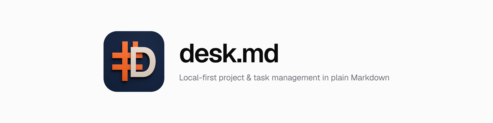
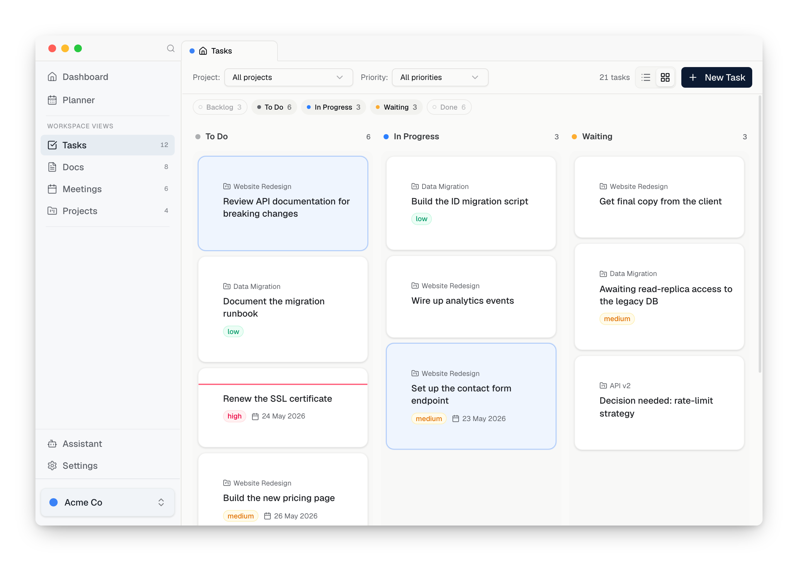
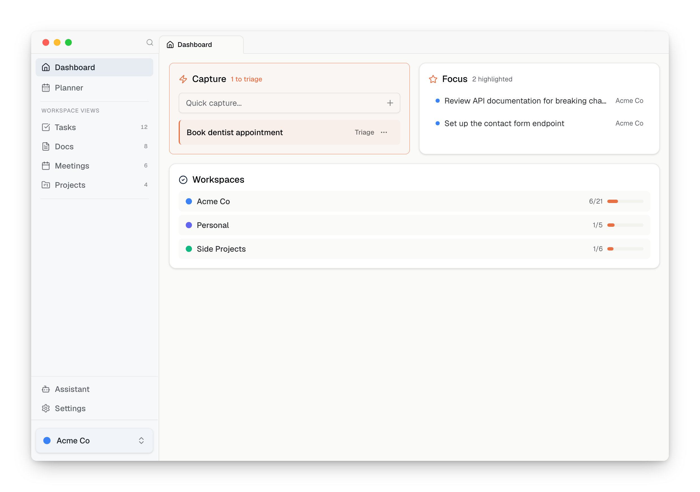
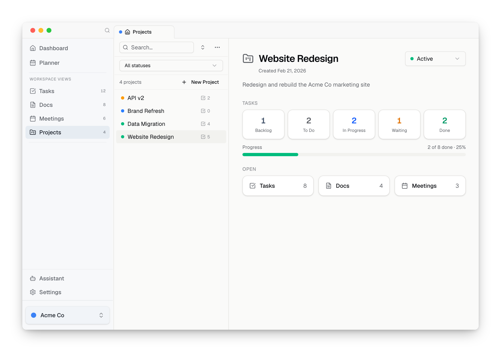
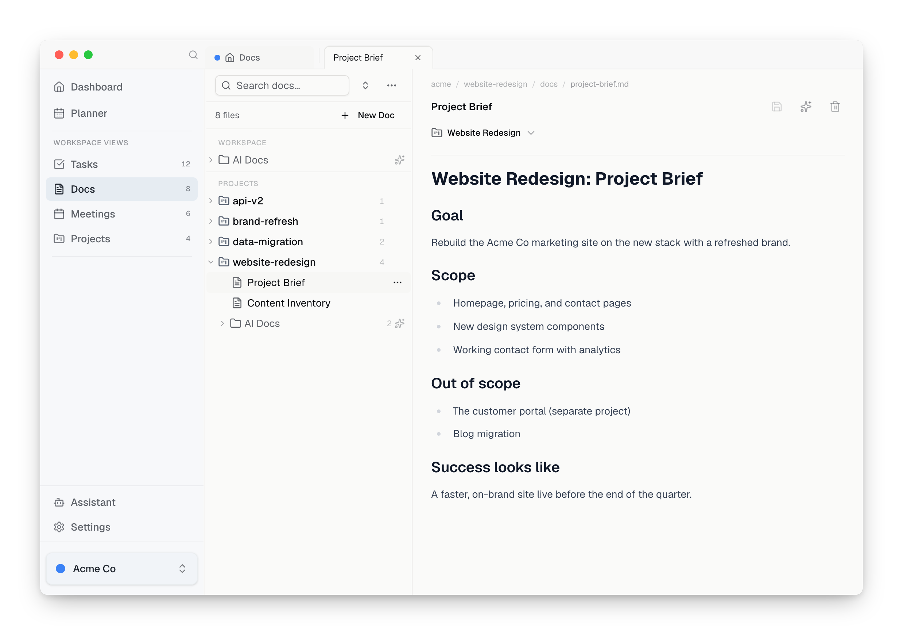
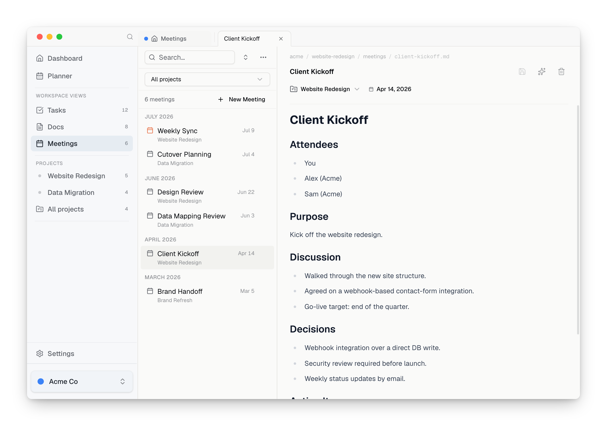

<p align="center">
  <picture>
    <source media="(prefers-color-scheme: dark)" srcset="assets/banner-dark.png">
    
  </picture>
</p>

<p align="center">
  <a href="./LICENSE"></a>
  
  
  
  
</p>

<p align="center">
  <picture>
    <source media="(prefers-color-scheme: dark)" srcset="assets/tasks-dark.png">
    
  </picture>
</p>

desk.md is a local-first desktop app for running your projects — tasks, docs,
and meetings — as plain Markdown files you own. Think of Obsidian's local vault,
but with project management built in from the first launch instead of assembled
from plugins. And because it's just a folder of Markdown, any AI agent — Claude
Code, Codex, Gemini CLI — picks up your full context with zero setup.

- **Own your data.** Plain Markdown with YAML frontmatter in an ordinary
  folder. No database, no lock-in. Open it in any editor, including Obsidian.
- **Built in, not bolted on.** Project management works on first launch:
  Workspace → Project → Tasks/Docs/Meetings with statuses, priorities, due
  dates, Kanban/list views, and a quick-capture inbox — no plugins to assemble
  or babysit.
- **Agent-ready.** desk.md auto-generates `CLAUDE.md`, `AGENTS.md`, and
  `GEMINI.md`, plus a summarized per-workspace catalog — so any AI agent
  understands your work with no plugins and no MCP server, just files.
- **Local-first.** Works fully offline. No account, no mandatory cloud.
- **Organized by workspace.** One workspace per client, side project, or area of
  life, each with its own projects, tasks, docs, and meetings.

## A look around

<table>
  <tr>
    <td width="50%">
      <a href="assets/dashboard-light.png"><picture><source media="(prefers-color-scheme: dark)" srcset="assets/dashboard-dark.png"></picture></a>
      <p align="center"><sub><b>Dashboard</b>: capture, focus, and workspace progress</sub></p>
    </td>
    <td width="50%">
      <a href="assets/projects-light.png"><picture><source media="(prefers-color-scheme: dark)" srcset="assets/projects-dark.png"></picture></a>
      <p align="center"><sub><b>Projects</b>: an overview with task stats and quick links</sub></p>
    </td>
  </tr>
  <tr>
    <td width="50%">
      <a href="assets/docs-light.png"><picture><source media="(prefers-color-scheme: dark)" srcset="assets/docs-dark.png"></picture></a>
      <p align="center"><sub><b>Docs</b>: a WYSIWYG Markdown editor with a file tree</sub></p>
    </td>
    <td width="50%">
      <a href="assets/meetings-light.png"><picture><source media="(prefers-color-scheme: dark)" srcset="assets/meetings-dark.png"></picture></a>
      <p align="center"><sub><b>Meetings</b>: notes and action items, per project</sub></p>
    </td>
  </tr>
</table>

## Who is it for?

desk.md is for technical solo operators — developers, indie hackers, makers, and
consultants who run their own work. People comfortable in the filesystem and the
terminal, who want to own their data and point AI agents at it. If you've ever
assembled Obsidian from a stack of plugins and watched them drift, this is
that — finished.

## Install

> Windows and Linux builds are **beta** — desk.md is developed and tested on macOS. Please
> [report anything broken](https://github.com/v1lling/desk.md/issues).

### macOS

1. Download `Desk_*.dmg` from the
   [latest release](https://github.com/v1lling/desk.md/releases/latest) — one
   universal build runs on both Apple Silicon and Intel Macs.
2. Open the DMG and drag **Desk** into Applications.
3. The app isn't notarized by Apple yet, so macOS reports it as "damaged" on the
   first launch. Clear the quarantine flag once, from Terminal:

   ```bash
   xattr -dr com.apple.quarantine /Applications/Desk.app
   ```

### Windows (beta)

Download and run the `.exe` installer from the
[latest release](https://github.com/v1lling/desk.md/releases/latest). The app
isn't code-signed yet, so SmartScreen shows a warning — click **More info → Run
anyway**.

### Linux (beta)

Download the `.AppImage` (runs on most distros) or a `.deb` / `.rpm` from the
[latest release](https://github.com/v1lling/desk.md/releases/latest). For the
AppImage, `chmod +x Desk_*.AppImage` and run it. Storing AI API keys needs a
desktop secret service (GNOME Keyring or KWallet), present on most desktop
installs.

desk.md keeps itself up to date automatically after install. Prefer to build it
yourself? See [Quick Start](#quick-start).

## Tech Stack

- Frontend: React, Vite, TypeScript, Tailwind CSS
- Desktop: Tauri 2
- UI: shadcn/ui
- State: Zustand + TanStack Query
- Storage: Local Markdown files in a folder you choose (default `~/Desk/`)

## Quick Start

desk.md is a Tauri desktop app. To run it from source:

```bash
npm install
npm run dev          # Browser with mock data (fast UI loop, no Rust needed)
npm run tauri:dev    # Desktop app with the real file system
```

> Use Node 22. Newer versions currently break Rollup's native dependency.
> See [CONTRIBUTING.md](./CONTRIBUTING.md) for the full setup.

## Data & files

desk.md stores user content under `workspaces/` and app metadata under `.desk/`,
inside the data folder you pick at setup (default `~/Desk/`). One workspace is
the **home workspace**, which holds the quick-capture inbox and is created the
first time you set up desk.md. Everything is plain Markdown: back it up, sync it,
or edit it in another app whenever you like.

## AI & agents

desk.md is not an AI agent framework. It's a project, task and doc manager you
run yourself; it just happens to be friendly to agents too. AI here is entirely
optional, and nothing leaves your machine unless you reach for it. It comes in
two forms.

**Bring your own agent.** desk.md keeps your data folder agent-ready. Alongside
your Markdown it auto-generates `CLAUDE.md`, `AGENTS.md`, and `GEMINI.md` — so
Claude Code, Codex, and Gemini CLI all understand your workspaces with zero
setup — plus a per-workspace `WORKSPACE_CONTEXT.md` that catalogs and summarizes
every file. These spell out the folder layout, the frontmatter schemas, and the
`ai-docs/` area an agent writes to so it never clutters your own notes. No MCP
server, no plugins, just files.

**In-app assistant.** There's also a built-in assistant for chat and drafting. It
uses your own Anthropic or OpenAI API key (**Settings → AI**). With no key, it
is simply off. When you use it, content goes directly to the provider you chose;
desk.md shows a one-time disclosure before the first request, reviewable anytime
under **Settings → AI → Data & Privacy**.

## Contributing

Bug reports, feature ideas, and pull requests are welcome. See
[CONTRIBUTING.md](./CONTRIBUTING.md) for setup and guidelines. This project
follows a [Code of Conduct](./CODE_OF_CONDUCT.md), and security issues have their
own [policy](./SECURITY.md).

To regenerate the screenshots above after a UI change: `npm run screenshots`.

## License

[GPL-3.0-or-later](./LICENSE). You're free to use, modify, and share desk.md.
Because the GPL is copyleft, any distributed fork or derivative must also stay
open-source under the GPL.
