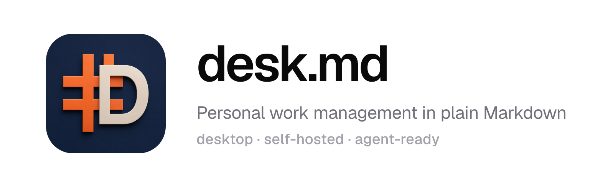
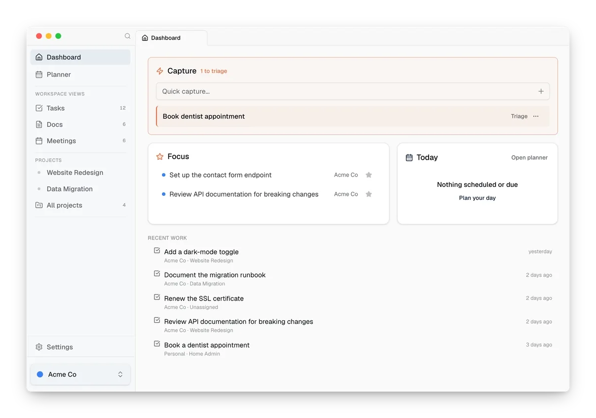
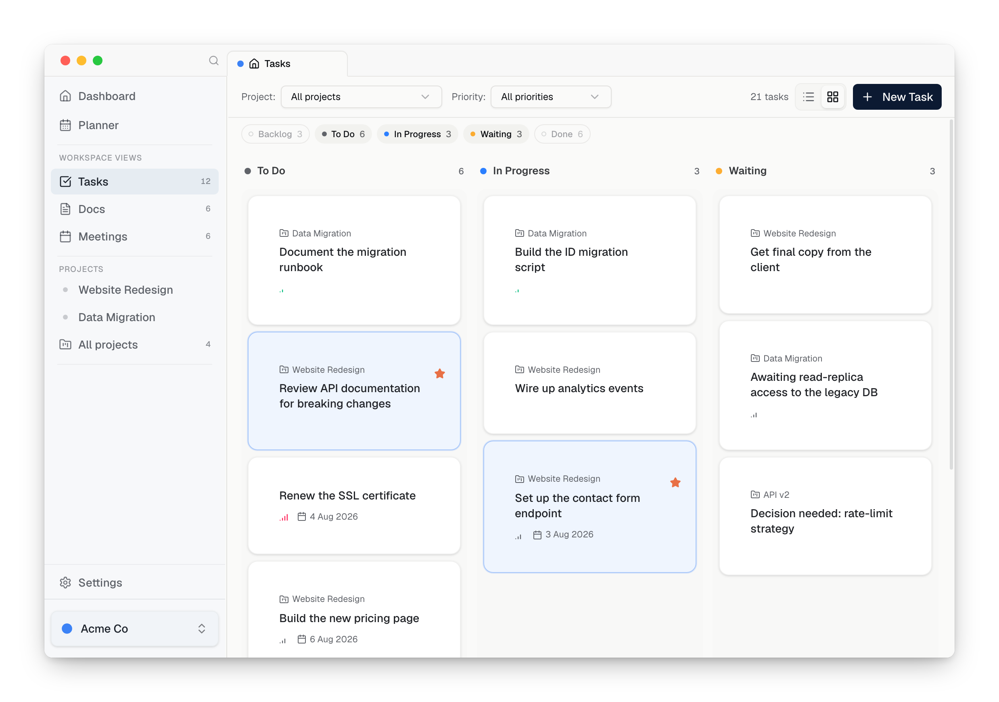
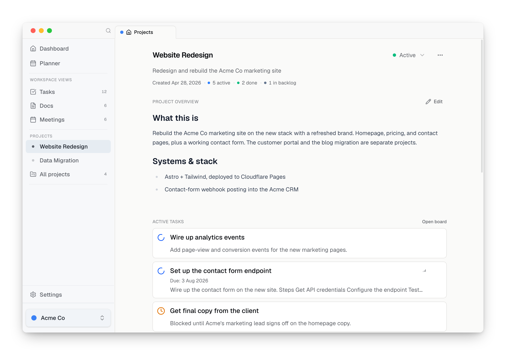
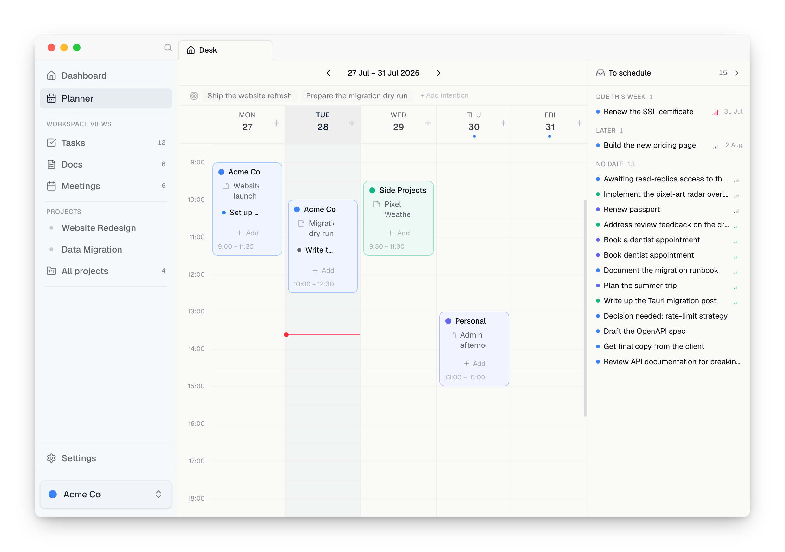
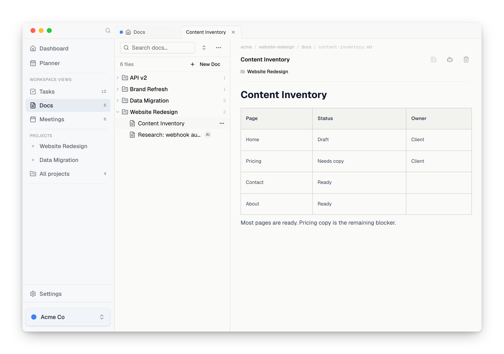
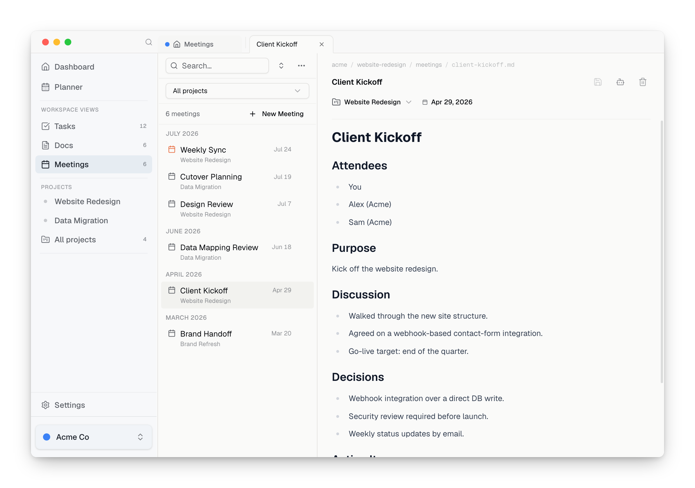

<p align="center">
  <picture>
    <source media="(prefers-color-scheme: dark)" srcset="assets/banner-dark.png">
    
  </picture>
</p>

<p align="center">
  <a href="./LICENSE"></a>
  
  
</p>

<p align="center">
  A calm personal workspace for projects, tasks, documents, meetings, and weekly planning.<br>
  The source of truth stays plain Markdown, accessible to you and the agents you choose.
</p>

<p align="center">
  <a href="https://github.com/v1lling/desk.md/releases/latest"><b>Download Desk</b></a>
  &nbsp;·&nbsp;
  <a href="#self-host"><b>Self-host</b></a>
  &nbsp;·&nbsp;
  <a href="#run-from-source"><b>Run from source</b></a>
</p>

<p align="center">
  <picture>
    <source media="(prefers-reduced-motion: reduce) and (prefers-color-scheme: dark)" srcset="assets/dashboard-dark.png">
    <source media="(prefers-reduced-motion: reduce)" srcset="assets/dashboard-light.png">
    <source media="(prefers-color-scheme: dark)" srcset="assets/tour-dark.webp">
    
  </picture>
</p>

<p align="center"><sub>Dashboard · Planner · Tasks · Documents · Meetings · Project</sub></p>

## Why I built Desk

I wanted a place to manage projects, tasks, documents, meetings, quick capture, and weekly planning without giving up the files underneath.
I had used Obsidian, Notion, and a few other tools, but kept running into the
same trade-off: flexible tools that needed a lot of setup or plugins, or a ready-made app that locked me into its own format and interface.
Desk gives me the structure and interface I was missing, while the workspace
itself stays ordinary Markdown.

That also means local agents can work with the folder directly. When Desk is
self-hosted, the same content is available through an OAuth-protected MCP endpoint.

<p align="center">
  <picture>
    <source media="(prefers-color-scheme: dark)" srcset="assets/tasks-dark.png">
    
  </picture>
</p>

## Built for one person running real work

Desk is especially useful for freelancers, consultants, developers, makers,
and other independent professionals who manage several streams of work and
care about owning their data.

- **Projects with orientation.** Every workspace and project has a user-owned
  Markdown overview, focused current work, and a lightweight schedule/history
  timeline assembled from its tasks, documents, and meetings.
- **Tasks and planning.** Kanban and list views, priorities, due dates, quick
  capture, status filters, and a weekly time-block planner.
- **Documents and meetings.** A WYSIWYG Markdown editor, nested folders, meeting
  notes, and drag-and-drop conversion from Word, PDF, Excel, CSV, and HTML.
- **Made for daily use.** Workspace switching, persistent editor tabs, global
  search, keyboard shortcuts, and protection for unsaved work.
- **Files that remain files.** Ordinary filesystem tools can open, back up, sync,
  search, and version the workspace.

Desk is intentionally a single-user product today. It is not a team PM system
with assignments, permissions, or real-time collaboration.

## Agent access

Desk does not put a chatbot in the middle of your work. It gives the AI tools
you already use a controlled way to read the context behind it.
Desk organizes durable source material for external
AI tools — but it does not try to be an AI workspace itself.

- **Local filesystem access.** Desk can generate `CLAUDE.md`, `AGENTS.md`,
  `GEMINI.md`, and per-workspace `WORKSPACE_INDEX.md` files so local agents
  understand the structure and read the right overview first.
- **Hosted MCP access.** A self-hosted server lets Claude, ChatGPT, Claude Code,
  and other MCP clients get workspace/project context, search globally, browse a
  structured catalog, and read exact sources over OAuth.
- **Optional Smart Index.** An Anthropic or OpenAI API key enables a summarized file
  catalog that helps agents find relevant files quickly.
- **Explicit boundaries.** `.aiignore` excludes content from the Smart Index and
  Desk's agent read layer, while generated local guidance carries the same
  boundary.

## Local or self-hosted

Both modes use the same Markdown structure. The difference is where the files
live and how they are reached.

| | **Local desktop** | **Self-hosted server** |
|---|---|---|
| Use it from | Native app on macOS, Windows, or Linux | Hosted web app, or the native app connected to the server |
| Data location | A folder on the local machine | A bind-mounted folder on the server |
| Network and login | Fully offline, no account | Account-protected, available across devices |
| Multi-device access | External sync if needed | One shared server-side copy |
| Agent connection | Filesystem plus generated agent files | OAuth-protected, read-only MCP |
| Smart Index key | Operating-system keychain | Server environment variable |

Moving between the two does not require a content migration. Hosting adds
`.desk/auth.sqlite` for accounts and sessions; workspaces remain Markdown files.

## Get started

### Install the desktop app

Desktop builds are available from the
[latest release](https://github.com/v1lling/desk.md/releases/latest). Desk keeps
itself up to date after installation.

Desk is developed and tested primarily on macOS. Windows and Linux builds are
**beta**, and the desktop builds are not code-signed yet.

<details>
<summary>Unsigned build notes</summary>

- **macOS:** Download `Desk_*.dmg` and drag **Desk** into Applications. If macOS
  says the app is damaged, run
  `xattr -dr com.apple.quarantine /Applications/Desk.app` once.
- **Windows:** Download the `.exe` installer. In the SmartScreen warning, choose
  **More info → Run anyway**.
- **Linux:** Use the `.AppImage`, `.deb`, or `.rpm`. Make an AppImage executable
  with `chmod +x Desk_*.AppImage`. AI keys require a desktop secret service such
  as GNOME Keyring or KWallet.

</details>

### Self-host

One Docker container serves the web app, domain API, OAuth server, and MCP
endpoint while keeping work content as Markdown on the server:

```bash
cd deploy
cp .env.example .env
# set BETTER_AUTH_SECRET
docker compose up -d
```

See the [self-hosting guide](./deploy/README.md) for HTTPS, reverse-proxy, AI,
and MCP setup.

## A closer look

<table>
  <tr>
    <td width="50%">
      <a href="assets/projects-light.png"><picture><source media="(prefers-color-scheme: dark)" srcset="assets/projects-dark.png"></picture></a>
      <p align="center"><sub><b>Project home</b></sub></p>
    </td>
    <td width="50%">
      <a href="assets/planner-light.png"><picture><source media="(prefers-color-scheme: dark)" srcset="assets/planner-dark.png"></picture></a>
      <p align="center"><sub><b>Weekly planner</b></sub></p>
    </td>
  </tr>
  <tr>
    <td width="50%">
      <a href="assets/docs-light.png"><picture><source media="(prefers-color-scheme: dark)" srcset="assets/docs-dark.png"></picture></a>
      <p align="center"><sub><b>Documents</b></sub></p>
    </td>
    <td width="50%">
      <a href="assets/meetings-light.png"><picture><source media="(prefers-color-scheme: dark)" srcset="assets/meetings-dark.png"></picture></a>
      <p align="center"><sub><b>Meetings</b></sub></p>
    </td>
  </tr>
</table>

## Roadmap

Ideas being explored:

- MCP write tools for explicitly requested notes and tasks
- Local-model support for the Smart Index
- Better mobile-web capture and review
- Optional task relationships and richer mobile-web capture

## Run from source

Desk is an npm-workspaces monorepo: `@desk/core` contains the shared domain,
`@desk/app` contains the React/Tauri client, and `@desk/server` provides the
self-hosted web, API, OAuth, and MCP services.

```bash
npm install
npm run dev          # browser with development fixtures
npm run tauri:dev    # desktop app with the real filesystem
```

Use Node 22. See [CONTRIBUTING.md](./CONTRIBUTING.md) for the complete setup and
project guidelines.

## Contributing

Bug reports, feature ideas, documentation improvements, and pull requests are
welcome. See [CONTRIBUTING.md](./CONTRIBUTING.md).

## License

[GPL-3.0-or-later](./LICENSE). Desk may be used, modified, and shared;
distributed forks and derivatives must remain open source under the GPL.
